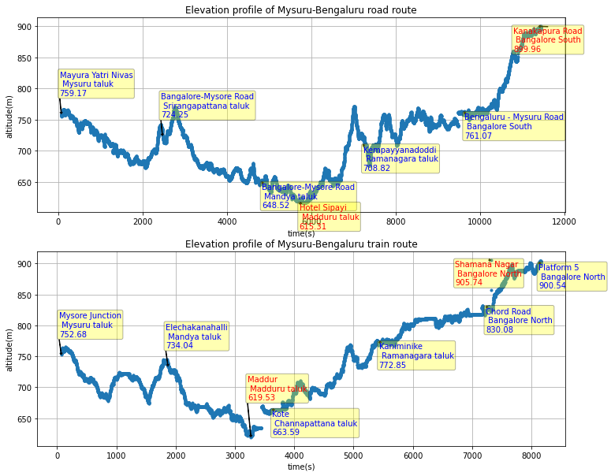

# Mysuru-Bengaluru Train Route Data
Contains the altitude, speed and gps data collected from PhyPhox app while travelling from Mysuru to Bengaluru in Train(Tuticoron express) and on road
From the lowest point in Maddur to the highest point in Bengaluru altitude changes by 900ft 
